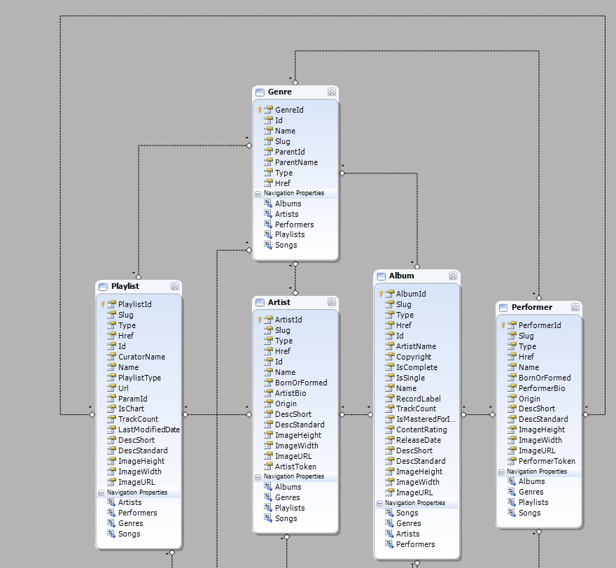
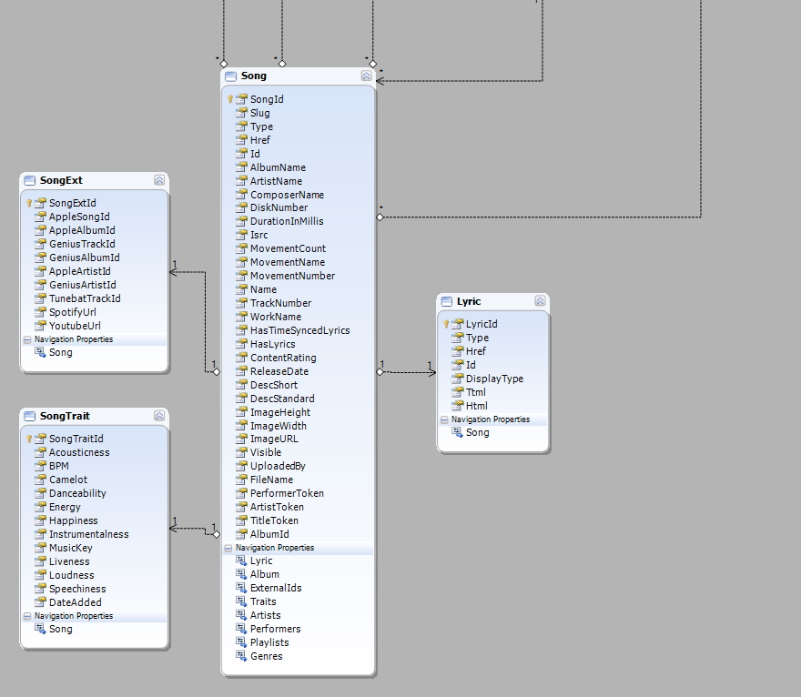

# MusicDb

MusicDb is a project to have an modern Sql Server music database and generate code and services to utilize it.

## Code generation

Generated items may be:
* Swagger/OpenAPI endpoints
* OData 4 endpoints
* Edmx diagrams for Entity Framework 6
* Entity Framework 6 models and context (scaffold code first)
* EF Core 5 models and context (scaffold code first)
* MVC Views for viewing/editing
* Unit tests for the UI and context
* SQL DDL Schema script

Generally, I want to take it from the schema to edmx / code first and back.

## Partial schema

The schema resembles the [Apple Music API](https://developer.apple.com/documentation/applemusicapi) with some modifications. There is also some analytics storage built in.
There are some 
* One to One 
* One to Many
* Many to Many relationships

*Artist and performer are essentially the same. Artist is the original recording artist, and performer would be a person who does a cover (like for karaoke).*

Additional metadata needed to be stored around songs, like Traits, and lyrics.
